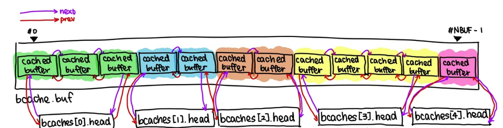

# lab5-COW
## kalloc.c
- 添加引用计数结构；

~~~c
// 物理页引用计数
struct {
  struct spinlock lock;
  int count[PHYSTOP / PGSIZE + 1];
} refcnt;

void increase_refcnt(void *pa)
{
  acquire(&refcnt.lock);
  refcnt.count[(uint64)pa / PGSIZE]++;
  release(&refcnt.lock);
}

void decrease_refcnt(void *pa)
{
  acquire(&refcnt.lock);
  refcnt.count[(uint64)pa / PGSIZE]--;
  release(&refcnt.lock);
}

int get_refcnt(void* pa)
{
  int cnt;
  acquire(&refcnt.lock);
  cnt = refcnt.count[(uint64)pa / PGSIZE];
  release(&refcnt.lock);
  return cnt;
}

// 初始化引用计数 = 1
void refcnt_init(void *pa) 
{
  acquire(&refcnt.lock);
  refcnt.count[(uint64)pa / PGSIZE] = 1;
  release(&refcnt.lock);
}
~~~

- kalloc初始化引用计数为1

~~~C
// Allocate one 4096-byte page of physical memory.
// Returns a pointer that the kernel can use.
// Returns 0 if the memory cannot be allocated.
void *
kalloc(void)
{
  struct run *r;

  acquire(&kmem.lock);
  r = kmem.freelist;
  if(r) {
    kmem.freelist = r->next;
    refcnt_init(r);
  }
  release(&kmem.lock);

  if(r)
    memset((char*)r, 5, PGSIZE); // fill with junk
  return (void*)r;
}
~~~

- kfree先减去引用计数，为0才释放内存

~~~C
void
kfree(void *pa)
{
  // 引用计数减1，只有引用计数归零才进行释放内存
  acquire(&kmem.lock);
  decrease_refcnt(pa);
  if(get_refcnt(pa) > 0) {
    release(&kmem.lock);
    return;
  }
  release(&kmem.lock);

  struct run *r;

  if(((uint64)pa % PGSIZE) != 0 || (char*)pa < end || (uint64)pa >= PHYSTOP)
    panic("kfree");

  // Fill with junk to catch dangling refs.
  memset(pa, 1, PGSIZE);

  r = (struct run*)pa;
  
  acquire(&kmem.lock);
  r->next = kmem.freelist;
  kmem.freelist = r;
  release(&kmem.lock);
}
~~~

## trap.c
- 需要考虑映射地址是否大于MAXVA
- 进程正文段.text只有读权限，COW不能重新分配物理页
## vm.c
- copyout时，进程正文段.text也不能copy
- va < PGSIZE，直接返回错误

## 结果
~~~shell
lzy@lzy:~/OSWorkspace/xv6-labs-2023$ make grade
== Test running cowtest == 
$ make qemu-gdb
(6.1s) 
== Test   simple == 
  simple: OK 
== Test   three == 
  three: OK 
== Test   file == 
  file: OK 
== Test usertests == 
$ make qemu-gdb
(33.3s) 
    (Old xv6.out.usertests failure log removed)
== Test   usertests: copyin == 
  usertests: copyin: OK 
== Test   usertests: copyout == 
  usertests: copyout: OK 
== Test   usertests: all tests == 
  usertests: all tests: OK 
== Test time == 
time: OK 
Score: 110/110
~~~