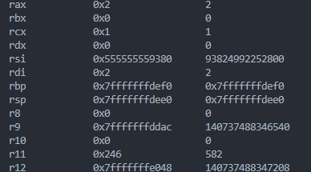
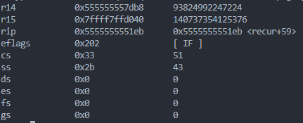
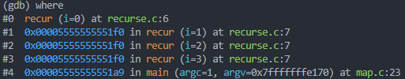

# map
## argv addr
- main (argc=1,argv=0x7fffffffe048)
## argv point to
- 可执行程序的位置
- 当前程序的PWD，shell，editor，gdb，vscode相关变量
- 环境变量
~~~shell
"/home/vagrant/code/personal/hw-intro/map"
"SHELL=/bin/bash"
"TERM_PROGRAM_VERSION=1.85.1"
"REMOTE_CONTAINERS_IPC=/tmp/vscode-remote-containers-ipc-978e2a3e-021c-445a-9601-feffc6509f92.sock"
"EDITOR=vim"
"PWD=/home/vagrant/code/personal/hw-intro"
"_=/usr/bin/gdb"
"VSCODE_GIT_ASKPASS_NODE=/home/vagrant/.vscode-server/bin/0ee08df0cf4527e40edc9aa28f4b5bd38bbff2b2/node"
"LINES=18"
"HOME=/home/vagrant"
"LANG=en_US.UTF-8"
"COLUMNS=89"
"REMOTE_CONTAINERS=true"
"PATH=/home/vagrant/.vscode-server/bin/0ee08df0cf4527e40edc9aa28f4b5bd38bbff2b2/bin/remote-cli:/usr/local/sbin:/usr/local/bin:/usr/sbin:/usr/bin:/sbin:/bin:/home/vagrant/.bin:/home/vagrant/.cargo/bin:/"
~~~
## recur function addr
- 0x5555555551b0

## i==0 recur

- argc = 1
## return 0 
~~~shell
mov $0x0, %eax
ret
~~~